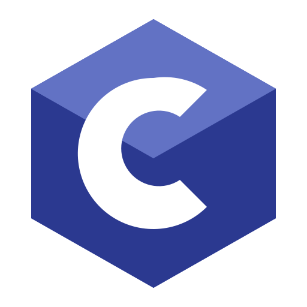

# 👋 Olá, eu sou Ryan Lucca!

🎓 Estudante de **Tecnologia em Sistemas para Internet** no IFSP.
💻 Desenvolvedor de software em formação, com interesse em desenvolvimento **Front-End e Back-End**.

### 🚀 Tecnologias

  
  
  
  
  
  
  
  

### 📚 Atualmente

Aprimorando meus conhecimentos em programação, desenvolvimento web, lógica de programação e desenvolvimento de aplicações.

### 🛠️ Projetos

Aqui você encontrará projetos acadêmicos e pessoais desenvolvidos durante minha formação, utilizados para colocar em prática os conhecimentos adquiridos e evoluir minhas habilidades como desenvolvedor.

### 📬 Contato

  
  

